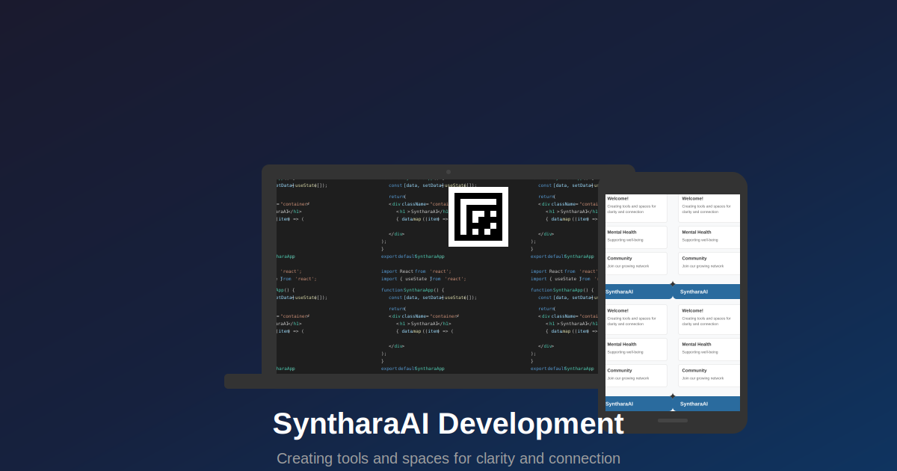

<div align="center">
  
</div>

# Niladri

**Crafting the future of AI, one line at a time.**

```cpp
#include <iostream>

void create() {
    std::cout << "Building clarity. Connecting ideas." << std::endl;
}

int main() {
    create();
    return 0;
}
```

## About

I’m a developer passionate about AI, system design, and open-source innovation. My work simplifies complexity and amplifies impact through elegant, scalable solutions.

- **Focus**: AI-driven applications, robust architectures.  
- **Skills**: AI/ML, Python (Flask), web development (HTML, CSS, JavaScript), open-source contributions.  
- **Vision**: Technology that empowers and inspires.

## Featured Project: SyntharaAI

A modern web platform powered by AI, designed to delight and perform.

- **What it does**: Delivers intuitive tools with a responsive UI.  
- **Highlights**:  
  - Custom Open Graph image editor.  
  - Gemini-powered chatbot.  
  - Flask backend, seamlessly deployed on Vercel.  
- **Built with**: [Augment Code](https://www.augmentcode.com/).  
- **Explore**: [Portfolio](bniladridas.github.io) | [Repo](#).

## Security, Done Right

SyntharaAI is built with trust in mind:  

- **Git Secret Removal**: Sensitive API keys erased from history, preserving functionality.  
- **API Key Management**: Securely stored as environment variables, never hardcoded.  
- **Deployment**: Vercel’s secure environment ensures peace of mind.

## Let’s Connect

Ideas, collaborations, or just a chat about tech—I’m all in.  
Reach me at [Portfolio](bniladridas.github.io).  

**To run SyntharaAI**:  
1. Verify Python 3.  
2. Install dependencies: `python3 -m pip install -r requirements.txt`.  
3. Launch: `python3 chatbot.py`.