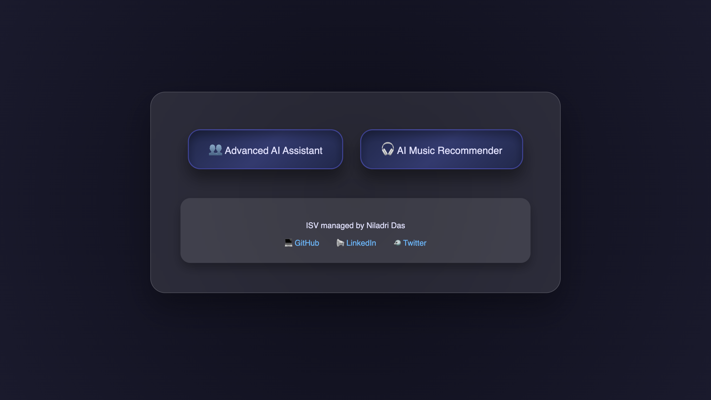

# Future System Design Projects

Welcome to the Future System Design Projects! This project showcases innovative applications powered by AI, including an advanced AI assistant and a music recommender.



## Features

- **Advanced AI Assistant**: A sophisticated AI tool designed to assist users with various tasks.
- **AI Music Recommender**: A smart music recommendation system that suggests songs based on user preferences.

## Getting Started

To run this project locally, follow these steps:

1. Clone the repository:
    ```bash
    git clone https://github.com/bniladridas/bniladridas.github.io.git
    ```

2. Navigate to the project directory:
    ```bash
    cd bniladridas.github.io
    ```

3. Open `index.html` in your web browser.

## Usage

Click on the buttons to interact with the AI applications. A sound effect will play upon clicking, followed by a 1-second delay before redirecting to the respective application.

## Contributing

Contributions are welcome! If you have suggestions or improvements, please create a pull request or open an issue.

## License

This project is licensed under the MIT License. See the LICENSE file for details.

## Maintenance

This project is actively maintained. For any issues or updates, please refer to the repository.

## Acknowledgments

Thanks to all contributors and supporters of this project.
Special thanks to the developers of the libraries and tools used in this project.

Cheers!
Thank you for checking out this project! Your support and feedback are greatly appreciated. Let's build a better future together!